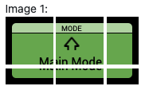

# MPC-Studio-Mk2-Midi-Sysex-Charts
In this repository, you will find the breakdown of the MIDI Note, CC, and Sysex data for the Akai MPC Studio Mk2. This is in no way sponsored by Akai.I'm actually a frustrated buyer and user of this product.

My attempts to use this product with other software left me very frustrated. Without the brains of the MPC 2 software, this device on its own is useless. It sends out midi data, but not in a way that is remotely usable. I fault Akai for this. It would have been very easy and simple for them to make a controller mode for this unit, and release MIDI technical specs in a PDF but they have not done so.

Through sending and observing MIDI data to and from the device, I have discovered that this is a "dumb" device. There is no logic on the device to perform any of it's functions or feedback, it is all controled by the software(MPC 2) through MIDI. That means if I can figure out what MIDI messages, I can program the device with other software... hint hint.. Ableton Live...

This repository is the result of me doing just that. I have figured out every element of the MPC Studio Mk2 with the exception of the LED display. 
*Any help is appreciated*. Enjoy!

## Config
-----
* You must use the Public port on the MPC Studio Mk2.
* The private port is only for the MPC Software


## Buttons
----
* Buttons send data on channel 1 (channel 0 if you're in code)
* Buttons send MIDI note data.
    * On = 127
    * Off = 0
* The Button Backlit LEDs are controlled through CC data, using the CC# that correspond to the midi note.
    * Example. Pressing Note Repeat sends MIDI Note **D -2** . The numerical value of this note is **11**. Thus the NoteRepeat button's LED will respond on MIDI CHannel 1, CC#: 11
* LED CC Values: These LEDs do not seem to be RGB. There are two types of LEDS on this device. Single Color, Two Color. Listed below are the CC values for each type:

### One Color LED
| Status   | Value |
|----------|-------|
| LED Off  | 0     |
| LED Dim  | 1     |
| LED Full | 2     |

### Two Color LED
| Status           | Value |
|------------------|-------|
| LED Off          | 0     |
| LED Color 1 Dim  | 1     |
| LED Color 2 Dim  | 2     |
| LED Color 1 Full | 3     |
| LED Color 2      | 4     |

Here is a full breakdown of the button Midi Note and CC values. 
### Button Note - LED Table
| Control               | Channel | NoteValue | Note | LED CC | LED Type         |
| --------------------- | ------- | --------- | ---- | ------ | ---------------- |
| Touch Strip Button    | 1       | 0         | C -1 | 0      | RED/WHITE        |
| Pad Mute              | 1       | 4         | E -1 | 4      | RED/WHITE        |
| Erase                 | 1       | 9         | A -1 | 9      | RED/WHITE        |
| Note Repeat           | 1       | 11        | B -1 | 11     | RED/WHITE        |
| Quantize              | 1       | 12        | C0   | 12     | RED/WHITE        |
| Track Select          | 1       | 13        | C# 0 | 13     | RED/WHITE        |
| Program Select        | 1       | 14        | D0   | 14     | RED/WHITE        |
| TC ON/OFF             | 1       | 15        | Eb 0 | 15     | WHITE            |
| Sample Start          | 1       | 33        | A1   | 33     | RED/WHITE        |
| Sample End            | 1       | 34        | Bb1  | 34     | RED/WHITE        |
| Pad Bank A/E          | 1       | 35        | B1   | 35     | RED/WHITE        |
| Pad Bank B/F          | 1       | 36        | C2   | 36     | RED/WHITE        |
| Pad Bank C/G          | 1       | 37        | C#2  | 37     | RED/WHITE        |
| Pad Bank D/H          | 1       | 38        | D2   | 38     | RED/WHITE        |
| Full Level            | 1       | 39        | Eb2  | 39     | RED/WHITE        |
| 16 Level              | 1       | 40        | E2   | 40     | RED/WHITE        |
| Sample Select         | 1       | 42        | F#2  | 42     | RED/WHITE        |
| Shift                 | 1       | 49        | C# 3 | 49     | RED/WHITE        |
| Browse                | 1       | 50        | D3   | 50     | RED/WHITE        |
| Main                  | 1       | 52        | E3   | 52     | RED/WHITE        |
| Tap Tempo             | 1       | 53        | F3   | 53     | RED/WHITE        |
| +                     | 1       | 54        | F#3  | 54     | WHITE            |
| \-                    | 1       | 55        | G3   | 55     | WHITE            |
| Zoom                  | 1       | 66        | F#4  | 66     | RED/WHITE        |
| Undo                  | 1       | 67        | G4   | 67     | RED/WHITE        |
| <                     | 1       | 68        | G#4  | 68     | WHITE            |
| \>                    | 1       | 69        | A4   | 69     | WHITE            |
| Locate                | 1       | 70        | Bb4  | 70     | WHITE            |
| <<                    | 1       | 71        | B4   | 71     | WHITE            |
| \>>                   | 1       | 72        | C5   | 72     | WHITE            |
| Record                | 1       | 73        | C# 5 | 73     | RED              |
| Automation READ/Write | 1       | 75        | Eb 5 | 75     | GREEN RED        |
| Tune                  | 1       | 79        | G 5  | 79     | RED/WHITE        |
| Overdub               | 1       | 80        | G#5  | 80     | RED              |
| Stop                  | 1       | 81        | A5   | 81     | WHITE            |
| Play                  | 1       | 82        | Bb5  | 82     | GREEN            |
| Play Start            | 1       | 83        | B5   | 83     | GREEN            |
| JOG Wheel             | 1       | 111       | Eb 8 | N/A    | N/A              |
| Mode                  | 1       | 114       | F#6  | 114    | RED              |
| Copy                  | 1       | 122       | D9   | 122    | RED/WHITE        |


## Touch Strip
----
The touchstrip's note on and off may very depending on MPC Software setting. The intial touch sends a Midi Note-On msg and sliding your finger up and down send CC messages.

#### Touch Strip Chart

|Action|Channel|NoteValue|Note|CC|
|------|-------|---------|----|--|
|Press | 1     | 78      |    |  |
|Slide | 1     |         |    |33|
|Slide | 1     | 78      |    |33|

When using the touch strip in the MPC software, you get feedback on the control via Red dots and the Note Repeat Values. This can also be manually lit up on indiviual CC values with brightness from 0-127. Yes... all this is done by the software and not in hardware.  If you want to emulate this, you'll need to do it manually but it's possible. Here is the breakdown

#### Touch Stip LED Chart

| Control               | Channel | NoteValue | Note | LED CC | LED Type         |
| --------------------- | ------- | --------- | ---- | ------ | ---------------- |
| TC Light 1            | 1       |           | N/A  | 57     | Brightness 0-127 |
| TC Light 2            | 1       |           | N/A  | 58     | Brightness 0-127 |
| TC Light 3            | 1       |           | N/A  | 59     | Brightness 0-127 |
| TC Light 4            | 1       |           | N/A  | 60     | Brightness 0-127 |
| TC Light 5            | 1       |           | N/A  | 61     | Brightness 0-127 |
| TC Light 6            | 1       |           | N/A  | 62     | Brightness 0-127 |
| TC Light 7            | 1       |           | N/A  | 63     | Brightness 0-127 |
| TC Light 8            | 1       |           | N/A  | 64     | Brightness 0-127 |
| TC Light 9            | 1       |           | N/A  | 65     | Brightness 0-127 |
| 1/4 note              | 1       |           | N/A  | 103    | Brightness 0-127 |
| 1/4 t                 | 1       |           | N/A  | 104    | Brightness 0-128 |
| 1/8 note              | 1       |           | N/A  | 105    | Brightness 0-129 |
| 1/8 t                 | 1       |           | N/A  | 106    | Brightness 0-130 |
| 1/16 note             | 1       |           | N/A  | 107    | Brightness 0-131 |
| 1/16 t                | 1       |           | N/A  | 108    | Brightness 0-132 |
| 1/32 note             | 1       |           | N/A  | 109    | Brightness 0-133 |
| 1/32 t                | 1       |           | N/A  | 110    | Brightness 0-134 |


## Jog Wheel
---
The Jog wheel is pretty straight forward. Nothing out of the ordinary here
* Turning it send a Midi CC message on CC# 100. Clockwise sends a value of 1. Counterclock sends a value of 127
* Pressing the Jog Wheel sends a Note on/off value of MIDI Note 111/D#7

| Direction | Value             |
| --------- | ----------------- |
| Forward   | 1                 |
| Reverse   | 127               |
| Press     | MIDI Note 111/D#7 |


## Pads
What we've all been waiting for... Those delicious MPC Studio Mk2 Pads... All jokes aside, they do feel nice to play on the LED feedback is wonderful. This was the hardest part to figure out but I finally got it. At the beginning of this document, I made the observation that there is no logic on this device that provides any of the feedback you get when using it with the MPC Software. This is even true for the pads. 

The Pads by default send Midi Note data when played and pressure-sensetive, aftertouch values. The LEDs however are not controlled from the device, but rather through sysex messages sent back to the device while playing... Yeah you got it... When you play a note, the software receives that note and send a MIDI sysex message back to the device to tell the PAD LED what color to show and how bright. 

This device really is a dumb device. To my knowledge there is no mode to set the pads to automatically do this. Feedback is welcomed. If you find anything different, let me know by submitting an issue to this repository. I did however figure out the sysex messages for the pads and how to send them to the device to mimic this behavior.

* Pad Numbers in code start at 0 and go to 15. So Pad 1 on the device, in code, is actually PAD 0. Thats how it is addressed in sysex messages too. Pad 1 in sysex code is *00* . Thats hexadecimal for the value *0*


### PAD LED Sysex break down
Sysex data is sent in hex bytes ranging from 0-127 with start bytes and end bytes. Here is the PAD Color Code

| Msg Start | Mfg ID | Dev ID | Model Id | Msg Type | Data Length | Data Length2 | Pad # | Red(0-127) | Green(0-127) | Blue(0-127) | Msg End |
| --------- | ------ | ------ | -------- | -------- | ----------- | ------------ | ----- | ---------- | ------------ | ----------- | ------- |
| F0        | 47     | 47     | 4A       | 65       | 00          | 4            | 00    | 7F         | 00           | 00          | F7      |

> F0 47 47 4A 65 00 04 00 7F 00 00 F7

The above sysex message will turn Pad 0 to bright red. The device will accept any combination of RGB values, so the pads could technically be whatever color you want. The values for Red Green, and Blue are 0-127 for each. If you're sending this to the device manually you will have to convert the numerical/decimal value to a hexadecimal value, so 127 is actuall 7F. Most scripting languages can do this conversion for you. 

With the knowledge of how the Pad LEDs work and a little python skill, I have created a replica program that allows me to play the pads and get LED feedback in the color of my choosing. You would think that all the traffic back and forth from the computer would introduce latency with the LED response, but that's not the case at all.

### PAD Led Sysex Cheat
Not all combination are here. Change the RGB values to get what you want. **Note. This chart is in HEXADECIMAL**
| Msg Start | Mfg ID | Dev ID | Model Id | Msg Type | Data Length | Data Length2 | Pad # | Red(0-127) | Green(0-127) | Blue(0-127) | Msg End |
| --------- | ------ | ------ | -------- | -------- | ----------- | ------------ | ----- | ---------- | ------------ | ----------- | ------- |
| F0        | 47     | 47     | 4A       | 65       | 00           | 04            | 00     | 7F         | 00            | 00           | F7 |
| F0        | 47     | 47     | 4A       | 65       | 00           | 04            | 01     | 7F         | 00            | 00           | F7 |
| F0        | 47     | 47     | 4A       | 65       | 00           | 04            | 02     | 7F         | 00            | 00           | F7 |
| F0        | 47     | 47     | 4A       | 65       | 00           | 04            | 03     | 7F         | 00            | 00           | F7 |
| F0        | 47     | 47     | 4A       | 65       | 00           | 04            | 04     | 7F         | 00            | 00           | F7 |
| F0        | 47     | 47     | 4A       | 65       | 00           | 04            | 05     | 7F         | 00            | 00           | F7 |
| F0        | 47     | 47     | 4A       | 65       | 00           | 04            | 06     | 7F         | 00            | 00           | F7 |
| F0        | 47     | 47     | 4A       | 65       | 00           | 04            | 07     | 7F         | 00            | 00           | F7 |
| F0        | 47     | 47     | 4A       | 65       | 00           | 04            | 08     | 7F         | 00            | 00           | F7 |
| F0        | 47     | 47     | 4A       | 65       | 00           | 04            | 09     | 7F         | 00            | 00           | F7 |
| F0        | 47     | 47     | 4A       | 65       | 00           | 04            | 0A    | 7F         | 00            | 00           | F7  |
| F0        | 47     | 47     | 4A       | 65       | 00           | 04            | 0B    | 7F         | 00            | 00           | F7  |
| F0        | 47     | 47     | 4A       | 65       | 00           | 04            | 0C    | 7F         | 00            | 00           | F7  |
| F0        | 47     | 47     | 4A       | 65       | 00           | 04            | 0D    | 7F         | 00            | 00           | F7  |
| F0        | 47     | 47     | 4A       | 65       | 00           | 04            | 0E    | 7F         | 00            | 00           | F7  |
| F0        | 47     | 47     | 4A       | 65       | 00           | 04            | 0F    | 7F         | 00            | 00           | F7  |


### Pad Note Chart
Here are the Pad notes. When you strike a pad, these are the note values that are sent to the host.

| Pad Number | Midi Note | Pad Number Code | Midi Note Value |
| ---------- | --------- | --------------- | --------------- |
| 1          | C#1       | 0               | 37              |
| 2          | C1        | 1               | 36              |
| 3          | F#1       | 2               | 42              |
| 4          | A#4       | 3               | 82              |
| 5          | E1        | 4               | 40              |
| 6          | D1        | 5               | 38              |
| 7          | A#1       | 6               | 46              |
| 8          | G#1       | 7               | 44              |
| 9          | C2        | 8               | 48              |
| 10         | B1        | 9               | 47              |
| 11         | A1        | 10              | 45              |
| 12         | G1        | 11              | 43              |
| 13         | C#2       | 12              | 49              |
| 14         | G2        | 13              | 55              |
| 15         | D#        | 14              | 51              |
| 16         | F2        | 15              | 53              |

# LCD Screen
We have finally figured out how to operate the LCD Screen on the MPC Studio Mk2. Thanks to [@gstepniewski](https://github.com/gstepniewski) and [@BlackBinary](https://github.com/BlackBinary) for their help in reverse engineering the LCD Screen

## Overview
The LCD screen works by sending 160x80 pixel PNG encoded images via SYSEX midi messages. However, it is not as simple as sending the bytes of a PNG message in a Sysex message after the header. The PNG must first be encoded to a format that is transmissible via MIDI. MIDI bytes are limited to 7bit, where as most modern image formats start at 8 bit/1byte values. 

Also, the image is not sent as one complete 160x80 png file. The image must be broken up into chunks. Each chunk is it's own png file and then encoded for transmission via MIDI. A sysex header and metadata is generated per chunk, and the message is sent to the device.

Each chunk has specified coordinates of the total image.



The X,Y coordinates for the chunks are listed below as X1, Y1, X2, Y2:

```
X1:0,   Y1: 0,  X2: 60,  Y2: 60
X1:0,   Y1: 60, X2: 60,  Y2: 80
X1:60,  Y1: 0,  X2: 120, Y2: 60
X1:60,  Y1: 60, X2: 120, Y2: 80
X1:120, Y1: 0,  X2: 160, Y2: 60
X1:120, Y1: 60, X2: 160, Y2: 80
```

The next obstacle to overcome is the Sysex header file and metadata per image. Each chunk sent must include metadata about the image chunk being sent. The formula for the generating the metatdata is listed below is sequence of bytes.

### Sysex LCD Chunk Header

| index |  value(hex)    | description                   |
| --    | --        | --                            |
| 0     | 0xF0 | Sysex Start Message|
| 1     | 0x47 | Manufacturer ID|
| 2     | 0x7F | Device ID|
| 3     | 0x4A | Model ID |
| 4     | 0x04 | Message ID |


### Sysex LCD Chunk Metadata
| index |  value(hex)    | description                   |
| --    | --        | --                            |
| 5-6   | *0x00, 0x00* (Calculated per chunk)| XX XX (2 bytes) Size of the sysex encoded png message size plus the header size in bytes(16) + a magic number in lsb(least Significant Byte) with the high byte first|
| 7-8   | 0x00 0x20 or 0x00 0x20 if payload >= 128 (Calculated per chunk) | (2 byte) If 20, add 128 to payload size. This byte depends on the payload size metadata which is calculated later|
| 9-12  | *(0x00, 0x00, 0x00, 0x00)* 4 Bytes (Calculated per chunk)  |XX 00 YY 00 (4 bytes)	X / Y Starting X/Y coordinates of the chunk |
| 13-14  | *(0x00, 0x00)* 4 Bytes (Calculated per chunk)  |Size of the image chunk png (decoded to png!), but the bytes are swapped (so 1 byte is encoded as 01 00) in lsb(least Significant Byte) with the low byte first. This size determines the byte order for index 7-8.|

### Sysex LCD Chunk Payload.
The payload for the sysex chunk is an PNG image complete with standard PNG image headers, compression data, etc. Essentially, everything related to a PNG file is in the payload. The only difference is that we must encode the PNG data in 7bit representation, which means we must do some bit shifting to make this possible. 

The developers at Akai chose to use a control byte for every 7 bytes. This allows them to encode values greater than 127(0x7F) in the sysex message. The process is to loop over the bytes in sets of 7 in the PNG image. If the byte is larger than 127, the control bit is set to 1 and then shifted into position of the byte in the group of 7. The byte that was larger has 128 subtracted from it. Once the the group of 7 is complete, the control byte is pushed to a new buffer, followed by the 7 bytes, and the process continues for the next 7 bytes. Here is the logic implementation in Go:

```go
func encode_png(original_png_buffer []byte) []byte {
	var encode_png_buffer []byte
	stride := 7
	for i := 0; i < len(original_png_buffer); i += stride {
		end := i + stride
		if end > len(original_png_buffer) {
			end = len(original_png_buffer)
		}
		group := original_png_buffer[i:end]
		control_byte := 0

		for j := 0; j < len(group); j++ {
			if group[j] >= 128 {
				control_byte |= 1 << j
				group[j] -= 128
			}
		}
		encode_png_buffer = append(encode_png_buffer, byte(control_byte))
		encode_png_buffer = append(encode_png_buffer, group...)
	}
	return encode_png_buffer
}
```

This will encode the PNG chunk to a format that can be sent via sysex. The same logic can be implemented in any language of your choosing. 

### Sysex Complete Message
Once the header, metadata, and payload have been generated, you can now concatenate the three sections, and append it with the sysex end byte (0xF7), and send it to the MPC Studio Mk2

```go
var msg []byte
msg = append(msg, header...)
msg = append(msg, metadata...)
msg = append(msg, payload...)
msg = append(msg, byte(0xF7))
```
This process will be done 6 times per frame sent to the device. There is no need to refresh the screen with a frame rate. The image will be displayed until you send another image, reset the device, or another programs takes control.

### POC (Proof of Concept)
Included in this repository are two POCs as demos of the screen being controlled by custom code. The first is in Javascript, using the sharp library and showing white noise on the screen. The second is in Go using mostly native imaging capabilities, and shows the control values as you press buttons on the device.

I'll be working on a Python, and C++ implementation POC for the LCD Screen as well.

This can be implemented in any programming language that supports midi, and imaging to some degree. Most of the performant imaging libraries are written on lower level languages, so it will be difficult to incorporate the screen in our custom MIDI scripts in the DAW. Most of the scripting environments don't allow to import libraries with C/C++ bindings.
